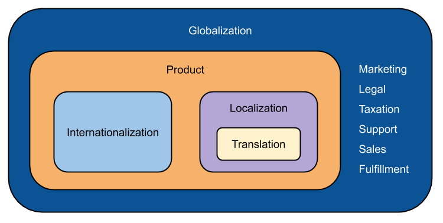
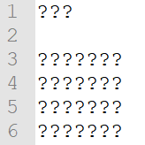
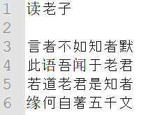
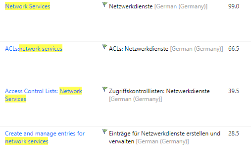
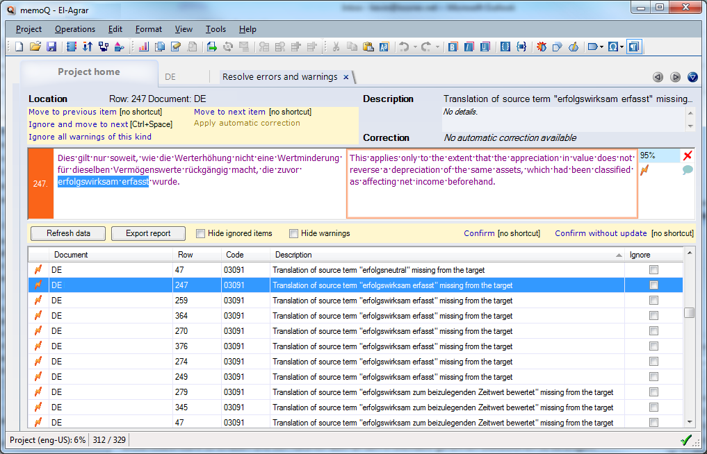
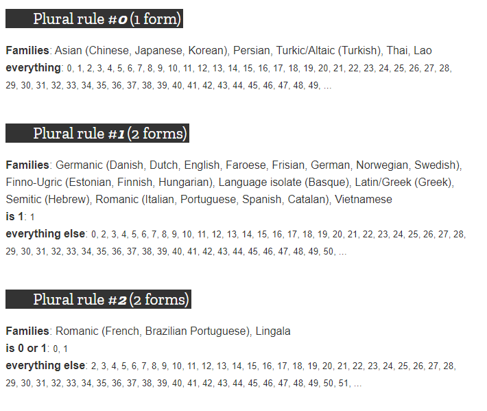
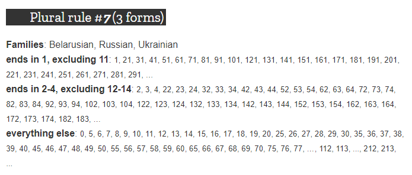
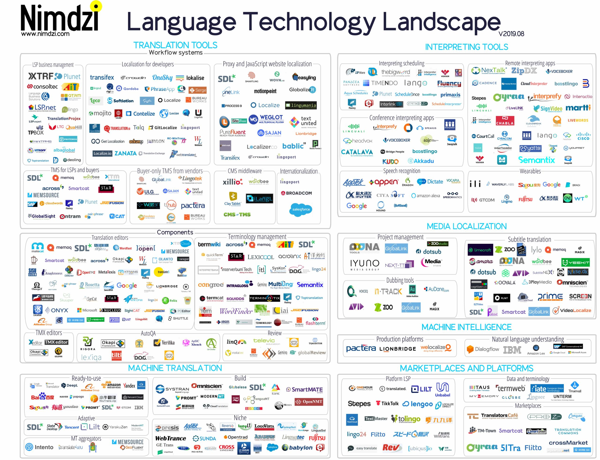
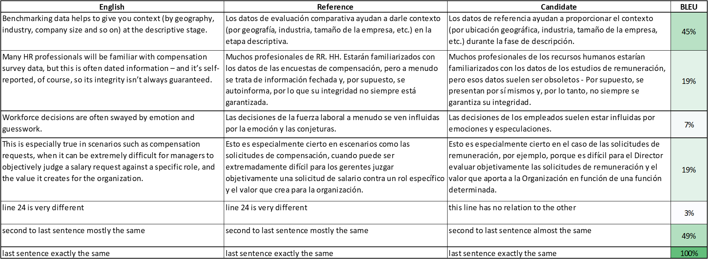
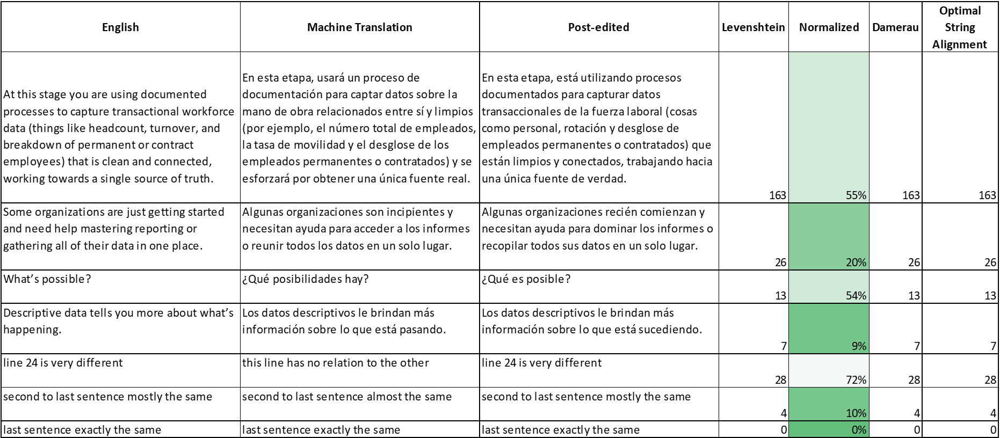

# Software Development with a Global Mindset

Startups who begin with a global mindset on day one will be well-prepared to expand to international markets. Below are 10 key elements of success.

{:toc}

## Understand Globalization

Going global involves four main activities, referred to collectively as GILT.

### Globalization

A company's overall transformation into a global company by adopting a global mindset. Known as **g12n**.

- Multilingual communication
- Global-readiness of products and services
- International trade policy
- Commercial processes
- Global education

### Internationalization 

Standardizing a product for localization readiness. Allows for software to be adapted to various languages and regions without requiring engineering changes to source code. Precedes localization. Known as **i18n**.

- Independence from a specific language/character set encoding

- Independence from specific cultural conventions

- Removal of hard-coded text

- Minimization of concatenated text strings

- Careful use of in-line variables

- Compatibility with third-party tools

- Unicode compliance for global text display

- Accommodation of double-byte languages (for example, Japanese)

- Accommodation of right-to-left languages (for example, Arabic)

### Localization

Adapting a product to a specific locale or market. Give a product the look and feel of having been created specifically for a target market, no matter the language, culture, or location. Localization includes translation. Known as **l10n**.
- Adapting graphics to target markets

- Modifying content to suit the tastes and consumption habits of other markets

- Adapting design and layout to properly display translated text

- Converting to local requirements (such as currencies and units of measure)

- Using proper local formats for dates, addresses, and phone numbers

- Addressing local regulations and legal requirements

### Translation

Translating content from one language to another. Known as **t9n**.

  - Convey the original tone and intent, taking into account cultural and regional differences
  - Alternatives include raw machine translation, post-edited machine translation, and transcreation.



## Externalize Strings

Separating strings from code makes it easy to manage translation. If strings are not separated, code could be damaged and text could be missed for translation. Typically, the below file types are used to externalize strings:

| Platform | File Type           |
| -------- | ------------------- |
| iOS      | Localizable.strings |
| Android  | strings.xml         |
| Java     | .properties         |

### Example Properties File

```properties
# You are reading the ".properties" entry.
! The exclamation mark can also mark text as comments.
# The key characters =, and : should be written with
# a preceding backslash to ensure that they are properly loaded.
# However, there is no need to precede the value characters =, and : by a backslash.
website = https://en.wikipedia.org/
language = English
# The backslash below tells the application to continue reading
# the value onto the next line.
message = Welcome to \
          Wikipedia!
# But if the number of backslashes at the end of the line is even, the next line is not included in the value. In the following example, the value for "key" is "valueOverOneLine\"
key = valueOverOneLine\\
# This line is not included in the value for "key"
# Add spaces to the key
key\ with\ spaces = This is the value that could be looked up with the key "key with spaces".
# The characters = and : in the key must be escaped as well:
key\:with\=colonAndEqualsSign = This is the value for the key "key:with=colonAndEqualsSign"
# Unicode
tab : \u0009
# If you want your property to include a backslash, it should be escaped by another backslash
path=c:\\wiki\\templates
# However, some editors will handle this automatically
```

## Avoid String Concatenation

Concatenating strings causes problems for languages with different word order than English.

```properties
# String concatenation
beginning = "Please join our webinar"
next = " on "
middle = " at "
end = "."
webinar.message = beginning + next + time + middle + date + end
# Expected message: Please join our webinar on April 1st at 5 pm.
```

This string would be re-constructed in Chinese like this:

```properties
# Translation of concatenated string
beginning = "请参加我们的网络研讨会"
next = "在"
middle = "在"
end = "。"
webinar.message = beginning + time + middle + date + end
# Resulting translation: 请参加我们的网络研讨会在April 1st在5 pm。
# INCORRECT for two reasons:
# 1) time and date have not been internationalized
# 2) Chinese uses different word order from English.
#    Time and date are stated first, then the invitation comes next.
```

Write the string correctly without concatenation:

```properties
# Correctly written string
invitation = "Please join our webinar on %1$s at %2$s."
# Please join our webinar on April 1st at 5 pm.
```

```properties
# Translation of correctly written string
invitation = "请在%1$s%2$s参加我们的网络研讨会。"
# 请在4月1日17点参加我们的网络研讨会。
```

Note that we are not translating the date or time, we are using an internationalized variable. That way, the date and time can be automatically represented according to international conventions.

## Use UTF-8 Everywhere

If you don't encode text in Unicode, users may see garbage:



They could instead be viewing a Chinese poem, *"Reading Laozi"*



I support the [UTF-8 Everywhere Manifesto](http://utf8everywhere.org/). "UTF-8 improves performance, reduces complexity of software, and helps prevent many Unicode-related bugs. Other encodings of Unicode belong to rare edge-cases of optimization and should be avoided by mainstream users."

"Across the industry, many localization-related bugs have been blamed on programmers' lack of knowledge in Unicode. We, however, believe that for an application that is not supposed to specialize in text, the infrastructure can and should make it possible for the program to be unaware of encoding issues."

## Reuse Translations

Translations can be stored and reused in a translation memory database. Typically, these are `.tmx` files, and are bilingual. Translation management systems and computer assisted translation software creates translation memories alongside the translation process.

Similar translations can be reused too, these are called "fuzzy matches" and have a percentage indicating the match rate. Translation memory reduces cost of future translations and ensures consistency.



## Standardize Terminology

Enforce consistent translation by using a term database and an automatic QA tool. Terminology is typically stored in a .tbx or .csv file. Forbidden terms and non-translatable terms can also be added.



## Internationalize

Dates, numbers, currencies, and region-specific data should not be hard coded. They should be auto-generated according to internationalization standards. This removes the need for translation and changing conventions, and ensures the product details appear correctly.

```properties
# The below strings work ok in English, but things get really messy in other langauges.
string.1 = "You have "
string.2 = "purchased %d books."
string.3 = "item(s) in your shopping cart."
purchase_confirmation = string.1 + string.2
# You have purchased 6 books.
shopping_cart = string.1 + " " + num + " " + string.3
# You have 3 item(s) in your shopping cart.
```

Consider that the word "have" can have multiple meanings. To possess something, or to indicate action in the past. This is sure to cause problems in translation.

Consider that in other languages, the form of the noun changes differently.

| English  | Russian  | Chinese |
| -------- | -------- | ------- |
| 0 books  | 5 книг   | 1本书   |
| 1 book   | 1 книга  | 1本书   |
| 2 books  | 2 книги  | 2本书   |
| 3 books  | 3 книги  | 3本书   |
| 4 books  | 4 книги  | 4本书   |
| 5 books  | 5 книг   | 5本书   |
| 21 books | 21 книга | 21本书  |
| 22 books | 22 книги | 22本书  |
| 23 books | 23 книги | 23本书  |
| 24 books | 24 книги | 24本书  |
| 25 books | 25 книг  | 25本书  |

Note that Arabic uses special rules to express plurals. If you are talking about two things, no need to use a number, just use the dual form of the noun.


There are [19 different ways](https://developer.mozilla.org/en-US/docs/Mozilla/Localization/Localization_and_Plurals) that languages use plural forms. Below are some examples.





Date and Time Internationalization (from [Java documentation](https://docs.oracle.com/javase/tutorial/i18n/format/dateintro.html))

`Date` objects represent dates and times. You cannot display or print a `Date` object without first converting it to a `String` that is in the proper format. Just what is the "proper" format? First, the format should conform to the conventions of the end user's `Locale`. For example, Germans recognize `20.4.09` as a valid date, but Americans expect that same date to appear as `4/20/09`. Second, the format should include the necessary information. For instance, a program that measures network performance may report on elapsed milliseconds. An online appointment calendar probably won't display milliseconds, but it will show the days of the week.

This section explains how to format dates and times in various ways and in a locale-sensitive manner. If you follow these techniques your programs will display dates and times in the appropriate `Locale`, but your source code will remain independent of any specific `Locale`.

## Take Advantage of Localization Tools

A well-developed localization operation needs tools. Below are some of the industry's finest tools, both commercial and open-source.

| Type                          | Commercial                                                   | Open-Source or Free                                          |
| ----------------------------- | ------------------------------------------------------------ | ------------------------------------------------------------ |
| Localization for Developers   | [Transifex](https://www.transifex.com/)<br />[Phrase](https://phrase.com/)<br />[Lokalise](https://lokalise.com/)<br />[Crowdin](https://crowdin.com/) | [Serge](https://serge.io/)<br />[Mojito](https://www.mojito.global/)<br />[GitLocalize](https://gitlocalize.com/)<br />[Loco](https://localise.biz/) |
| Engineering and QA            | [ApSIC Xbench](https://www.xbench.net/)                      | [Okapi Rainbow](https://okapiframework.org/wiki/index.php/Rainbow)<br />[Okapi Olifant](http://okapi.sourceforge.net/Release/Olifant/Help/) |
| Computer Assisted Translation | [memoQ](https://www.memoq.com/)<br />[SDL Trados Studio](https://www.sdltrados.com/products/trados-studio/)<br />[Memsource](https://www.memsource.com/)<br />[XTM Cloud](https://xtm.cloud/) | [OmegaT](https://omegat.org/)<br />[Qt Linguist](https://doc.qt.io/qt-5/qtlinguist-index.html)<br />[matecat](https://www.matecat.com/)<br />[Smartcat](https://www.smartcat.ai/) |
| Website Localization          | [Smartling](https://www.smartling.com/)<br />[easyling](https://www.easyling.com/) |                                                              |



## Machine Translation

Post-edited machine translation can meet human quality standards. Consider plugging in machine translation into your workflow.

To evaluate machine translation quality, measure edit distance (Normalized Levenshtein) and BLEU score (Bilingual Evaluation Understudy Score).

### BLEU

- Requirements:
  - Source text
  - Candidate raw machine translation
  - Reference human translation
- One sentence per line
- Suggested length: > 1000 words
- Measures how close raw MT is to a reference human translation
- Two good quality human translations may not be identical
- A good BLEU score may be somewhere between 20-40%
- Depends heavily on context

```python
from pathlib import Path
import pandas as pd
from nltk.translate.bleu_score import sentence_bleu
from nltk.tokenize import word_tokenize
from nltk.translate.bleu_score import SmoothingFunction

ENGLISH = Path(r"sample_en.txt")
RAW_MT = Path(r"sample_baidu.txt")
REFERENCE = Path(r"reference.txt")

result = list()
COLUMNS = ["English",
           "Reference",
           "Candidate",
           "BLEU"]

with open(ENGLISH, encoding="UTF-8") as a, open(RAW_MT, encoding="UTF-8") as b, open(REFERENCE, encoding="UTF-8") as c:
    for english, candidate, reference in zip(a.readlines(), b.readlines(), c.readlines()):
        en_token = word_tokenize(english)
        reference_token = word_tokenize(reference)
        candidate_token = word_tokenize(candidate)
        score = sentence_bleu([reference_token], candidate_token, smoothing_function=SmoothingFunction().method1)
        result.append([english, reference, candidate, score])

df = pd.DataFrame(result, columns=COLUMNS)
df.to_excel("BLEU.xlsx", index=False)
```



### Edit Distance

- Requirements:
  - Source text
  - Candidate raw machine translation
  - Reference human translation
- One sentence per line
- Suggested length: > 1000 words
- Measures how many edits were necessary to post-edit a machine translation to meet human translation standards
- More editing indicates poorer quality MT
- Lower scores are better

```python
from pathlib import Path
import pandas as pd
from similarity.levenshtein import Levenshtein
from similarity.damerau import Damerau
from similarity.optimal_string_alignment import OptimalStringAlignment
from similarity.normalized_levenshtein import NormalizedLevenshtein

ENGLISH = Path(r"sample_en.txt")
RAW_MT = Path(r"sample_baidu.txt")
PEMT = Path(r"post_edited.txt")

levenshtein = Levenshtein()
normalized_levenshtein = NormalizedLevenshtein()
damerau = Damerau()
optimal_string_alignment = OptimalStringAlignment()

result = list()
COLUMNS = ["English",
           "Machine Translation",
           "Post-edited",
           "Levenshtein",
           "Normalized Levenshtein",
           "Damerau",
           "Optimal String Alignment"]

with open(ENGLISH, encoding="UTF-8") as a, open(RAW_MT, encoding="UTF-8") as b, open(PEMT, encoding="UTF-8") as c:
    for english, raw_mt, pemt in zip(a.readlines(), b.readlines(), c.readlines()):
        lv = levenshtein.distance(raw_mt, pemt)
        norm_lv = normalized_levenshtein.distance(raw_mt, pemt)
        dam = damerau.distance(raw_mt, pemt)
        osa = optimal_string_alignment.distance(raw_mt, pemt)
        result.append([english, raw_mt, pemt, lv, norm_lv, dam, osa])

df = pd.DataFrame(result, columns=COLUMNS)
df.to_excel("Edit Distance.xlsx", index=False)
```



## Build your Own Tools

I've built my own set of localization tools. My tools bridge gaps between systems, automate processes, and guarantee high quality localization. See examples of custom Python tools on my [GitHub page](https://github.com/nicklambson?tab=repositories). Most of my tools have been developed for private clients and are not public.

